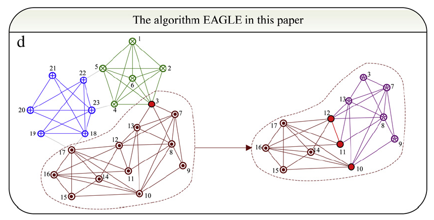
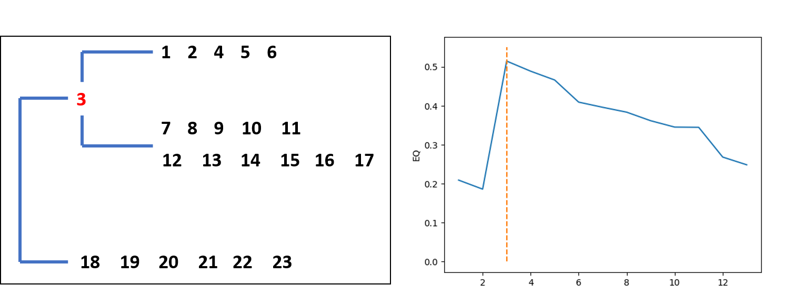

# EAGLE

Implement of EAGLE (agglomerativE hierarchicAl clusterinG based on maximaL cliquE) algorithm for network community detection proposed in paper [Detect overlapping and hierarchical community structure in networks](https://arxiv.org/pdf/0810.3093.pdf) by Huawei Shen et al..

## Reference: 

* Shen, H., et al. (2009). "Detect overlapping and hierarchical community structure in networks." *Physica A: Statistical Mechanics and its Applications* 388(8): 1706-1712.
* Shen, H.-W. (2013). Community structure of complex networks, Springer Science & Business Media.

## Requirements

```text
matplotlib==3.5.1
networkx==2.6.3
numpy==1.22.2
```

To install the requirements:

```text
pip install -r requirements.txt
```

## Example

To run the example code, run *example.py*:

```text
python example.py
```

Here we reproduce Figure 1(d) from the paper. Example codes can be found in *example.py* which detected three overlapped communities in the original network. 

 

The figure below illustrates the curve of EQ corresponding to each cover
of the network when the dendrogram is cut at different layer.



## Citation

If you find this code useful for your research, please cite:

```
@misc{HaoZhu10015_2022,
  author = {HaoZhu10015},
  title = {EAGLE},
  year = {2022},
  publisher = {GitHub},
  journal = {GitHub repository},
  howpublished = {\url{https://github.com/HaoZhu10015/EAGLE}},
}
```
